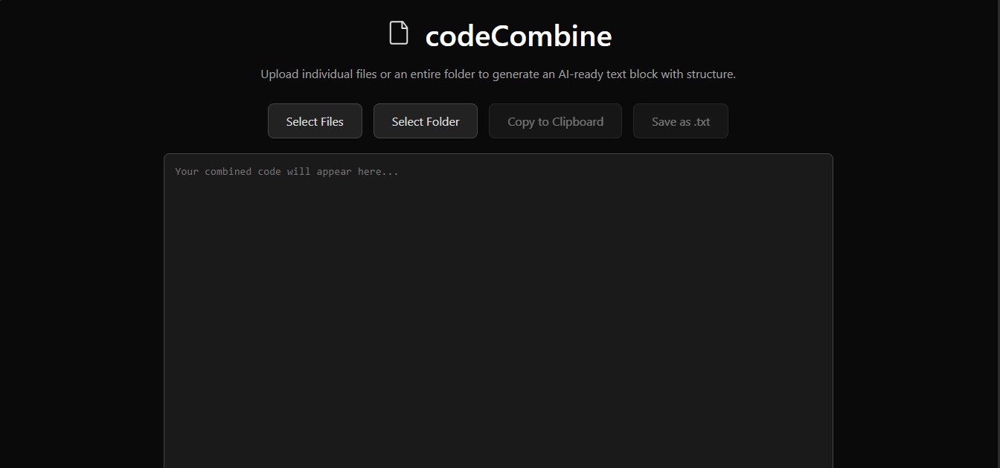

# codeCombine


codeCombine is a lightweight web tool that combines multiple files or folders into a single, well-structured text block that is ready to paste into AI tools.

It preserves file structure and wraps each file in proper code blocks for clarity.

---

## Features

* Upload individual files or entire folders
* Generates a folder tree at the top
* Combines files into one output
* Adds language-specific code fences
* Copy to clipboard
* Save output as `.txt`
* Runs fully in the browser

---

## Output Format

codeCombine produces two sections:

### 1) File Tree

```
codepaste/
   another folder/
      --something.py
   --index.html
   --paste.py
```

### 2) Combined Code

````
codepaste/another folder/something.py
```python
print("this is something")
````

codepaste/index.html

```html
<!DOCTYPE html>
<html lang="en">
<head>
  <meta charset="UTF-8">
  <title>codeCombine</title>
</head>
<body>
</body>
</html>
```

codepaste/paste.py

```python
print("hello")
```

```

This structure makes it easy for AI models to understand both layout and content.

---

## Supported Languages (Auto Detected)

- Python  
- JavaScript  
- HTML  
- CSS  
- Other files are included as plain text

---

## Usage

1. Open the website  
2. Click **Select Files** or **Select Folder**  
3. View combined output  
4. Copy or save as `.txt`

---

## Why This Exists

Pasting many files into AI tools one-by-one is slow and messy.

codeCombine packages entire projects into a single clean block so AI can:

- Read structure  
- Understand relationships  
- Give better answers

---

## Limitations

- No compression  
- No binary file support  
- No editing inside the tool

---

## License

Apache 2.0

---
